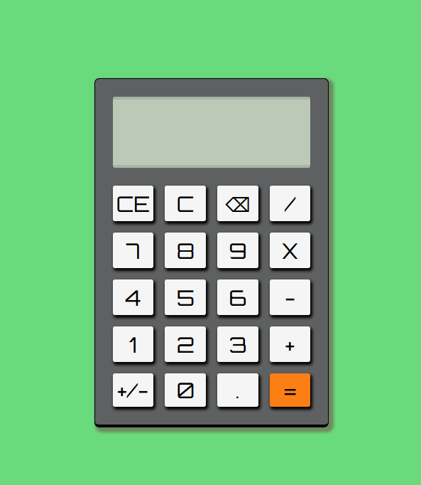

# Calculator!

This is a basic calculator app with all basic functions.

# 📝 Table of contents

-   [Live demo](#live-demo)
-   [Screenshot](#screenshot)
-   [Tech stack](#tech-stack)
-   [Author](#author)

# 🟢 Live demo [Calculator]()

# 📷 Screenshot

## Built with

# 🔗 Author

